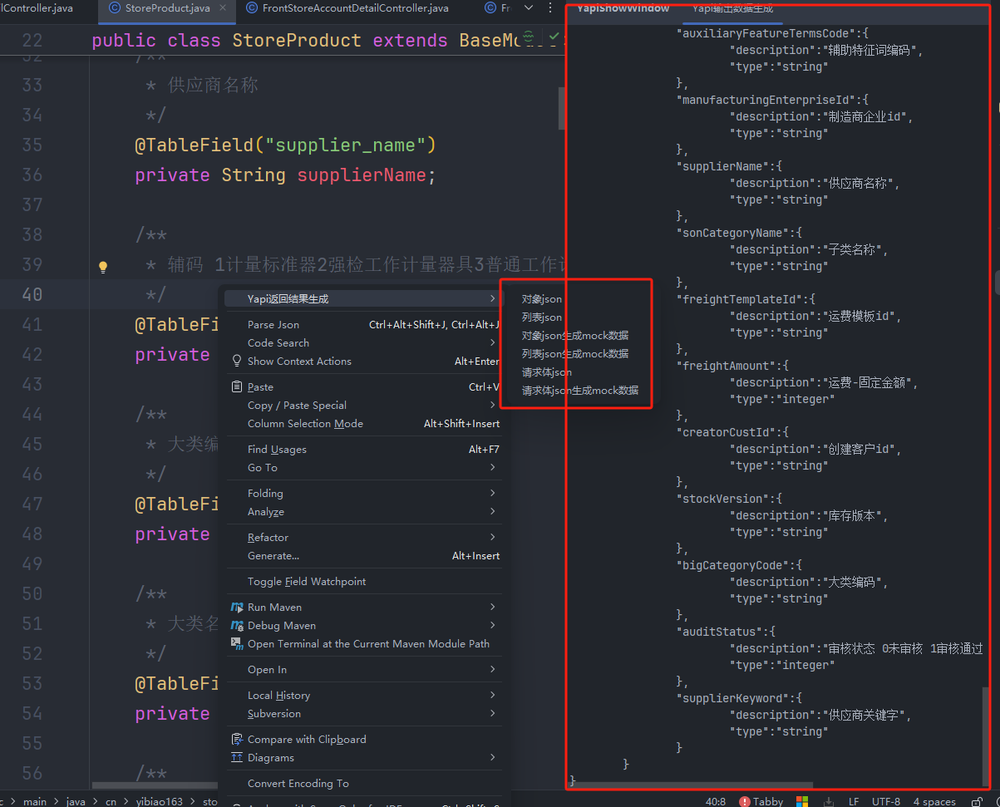

# 🔧 Yapi Generate Plugin for IntelliJ IDEA

该插件用于在 **IntelliJ IDEA** 中根据 Java 实体类自动生成 Yapi 接口定义的 JSON 数据与文档，提升接口编写效率。

---

## 📦 Installation / 安装方式

### ✅ 方法一：通过 JetBrains Plugin Portal 安装（推荐）

1. 打开 IDEA，点击 `Settings (Preferences) -> Plugins`
2. 搜索关键词：`Yapi Generate`
3. 点击安装并重启 IDE

### 🧰 方法二：本地 jar 安装

1. 下载发行版插件（`.jar` 文件），例如：`yapi-generate-1.1-SNAPSHOT.jar`
2. 打开 IDEA，点击 `Settings -> Plugins -> ⚙ -> Install Plugin from Disk...`
3. 选择 `.jar` 文件后点击安装，重启 IDEA 即可生效

---

## 🖼️ Screenshots / 插件截图

### ▶️ Controller 上按钮展示


---

### ▶️ 实体类右键菜单生成 JSON



---

## 🚀 Usage Method / 使用方式

### ✅ Usage Method 1 / 使用方式一

在 Controller 方法上方会出现三个按钮：

- **文档生成**：生成当前接口的 Yapi 文档（侧边栏窗口展示）。
- **文档生成（同时生成 Mock 数据）**：生成接口文档并附带 Mock 数据（侧边栏窗口展示）。
- **在 Yapi 上创建接口**：在 `Settings -> Tools -> yapi_setting` 配置 Yapi 信息后，点击按钮直接创建接口。
- **在 Yapi 上创建接口（含 Mock 数据）**：在配置好 Yapi 信息后，点击按钮直接创建接口，同时生成 Mock 数据。

### ✅ Usage Method 2 / 使用方式二

在实体类上右键选择 “**Yapi 返回结果生成**” 菜单项，可自动生成对应的 Yapi JSON 数据结构。

---

## ✨ Features / 功能特性

1. 支持生成对象返回结果，可选择是否包含 Mock 数据。
2. 支持生成列表返回结果，可选择是否包含 Mock 数据。
3. 支持生成请求体对象 JSON，可选择是否包含 Mock 数据。

---

## ⚠️ Notes / 注意事项

- 接口方法的路径参数和拼接参数备注信息由注释文档中的 `@param` 提取，请使用 `/** */` 风格的 JavaDoc 注释。
- 接收参数为对象类型时，备注信息从对象属性的注释中读取，也请使用 `/** */` 注释。
- **暂不支持 `Map` 类型参数的解析**，因为静态代码分析中无法获取其泛型键值类型。
- Mock 数据的生成依赖 **大语言模型（LLM）**，请在插件设置中配置有效的 API Key。
- 支持设置 **额外参数配置**：如果某些参数由拦截器注入（如签名、时间戳等），你可以配置路径匹配来添加这些固定参数。

---

### 📦 额外参数配置示例

```json
{
  "pathMatch": "/api/**",
  "extraParams": [
    {
      "name": "timestamp",
      "required": "1",
      "example": "123",
      "desc": "时间戳"
    },
    {
      "name": "nonce",
      "required": "1",
      "example": "123",
      "desc": "随机长整型"
    },
    {
      "name": "signature",
      "required": "1",
      "example": "77B27281779BD60CAE952FA1232368D2",
      "desc": "签名"
    },
    {
      "name": "accessToken",
      "required": "1",
      "example": "5d622aea8221e150fcede59823e84e10",
      "desc": "访问令牌"
    }
  ]
}
